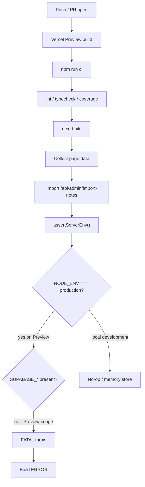

# Why Vercel deployments keep failing

**Status:** Diagnosed 2026-07-14 · Fix prepared on `cursor/map-pinpoint-tonight-chip-fdb7` (PR #264)
**Project:** `pubmax69/pubmax` · Production host: `pubmaxxing.com`

---

## Short answer

**No — the map-pinpoint / Tonight-chip PR is not on Vercel Production.**
Preview builds for PR branches were failing at `next build` with:

```text
Error: FATAL: Supabase is not configured in production
(SUPABASE_URL and SUPABASE_SERVICE_ROLE_KEY are required).
…
Failed to collect page data for /api/admin/import-notes
Error: Command "npm run ci" exited with 1
```

Production (`pubmaxxing.com`) is still serving an older **READY** deployment from another branch. That is why the live site still shows the old overlapping map chrome.

---

## What Vercel was doing

| Item | Value |
|------|--------|
| Build command | `npm run ci` → `verify` (lint/typecheck/coverage/audit) + `next build` |
| Config | `vercel.json` → `"buildCommand": "npm run ci"` |
| Failing step | `buildStep` after TypeScript, during **Collecting page data** |
| Error code | `BUILD_UTILS_SPAWN_1` |
| Example failed Preview | `dpl_4GY8MPCBcnoGsCVB8xPwcuJAszPh` (PR #264, sha `8460119`) |
| Last known Production READY | `dpl_BGVTPFphhEsa1W1dZkxX2UT96WUk` (different branch; not this PR) |

The same FATAL appeared on multiple Preview deploys (#263, #264) — this is a **systemic Preview failure**, not a one-off flake from the map UI commits.

---

## Root cause (chain)

1. API routes call `assertServerEnv()` **at module import** (e.g. `app/api/admin/import-notes/route.ts`).
2. That guard used `process.env.NODE_ENV === "production"`.
3. On Vercel, **both Preview and Production set `NODE_ENV=production`**.
4. Supabase / moderation secrets (`SUPABASE_URL`, `SUPABASE_SERVICE_ROLE_KEY`, and often `ADMIN_TOKEN` / `RATE_LIMIT_SALT`) are typically scoped to **Production only** in the Vercel project.
5. Preview therefore builds with `NODE_ENV=production` but **without** those secrets.
6. During `next build` → “Collecting page data”, Next evaluates the route module → `assertServerEnv()` throws → build aborts → GitHub check `Vercel – pubmax` = **FAILURE**.

So the deploy “keeps failing” because Preview is treated as production by `NODE_ENV`, while secrets stay Production-scoped.



---

## What is *not* the cause

- Not Greptile / CodeRabbit (those were SUCCESS / unrelated).
- Not Turbopack NFT warnings (`venueImageHosts.server.ts`) — noisy, not fatal.
- Not seed URL warnings (`query:…` discovery strings) — logged, not fatal.
- Not the map / Tonight UI commits themselves — failure happens before a successful artifact is published.
- `chengdu` project Preview can still go green; the failing status on the PR is **`Vercel – pubmax`**.

---

## Fix (code)

Shipped in this branch:

- `lib/serverEnv.ts` — `isDeployedProduction()` keys off **`VERCEL_ENV === "production"`** when set; Preview/development skip the FATAL.
- `lib/supabase.ts` — `requiresSupabaseStore()` mirrors the same rule so Preview runtimes can use the memory store instead of 503-ing every write.
- Tests updated in `__tests__/serverEnv.test.ts`.

**Production remains strict:** missing Supabase on a Production target still FATALs. The `PUBMAX_E2E_KEYLESS=1` test escape hatch is ignored for storage when `VERCEL_ENV=production`, and never relaxes trusted signing in any `NODE_ENV=production` process. Local production-style Playwright servers receive a fresh random signing secret through `webServer.env`, not their command or argv.

---

## Preview storage policy — current behaviour

`requiresSupabaseStore()` returns `false` whenever `VERCEL_ENV=preview`, so **Preview always uses the in-memory store — even if Supabase secrets are configured for the Preview environment**. Enabling Preview secrets alone does not make Preview storage durable; that would need a deliberate policy/code change (e.g. keying the store on secret presence rather than environment). This is intentional for now: Preview data is ephemeral by design.

Configuring Preview-scoped secrets is therefore optional and only affects features that read them directly (not the store selection):

1. Open **Project → Settings → Environment Variables**.
2. Enable **Preview** scope for any vars those features need.
3. Redeploy the PR Preview after saving.

Optional hardening:

- Keep Production-only for the most sensitive keys if Preview must stay ephemeral — the code fix then intentionally allows the memory store on Preview.
- Consider splitting `vercel.json` buildCommand later (`next build` on Vercel, full `npm run ci` in GitHub Actions) so a secret misconfig fails CI without blocking every Preview compile — not required for this fix.

---

## How to verify after redeploy

1. PR #264 → **Vercel – pubmax** check turns **SUCCESS**.
2. Open the Preview URL from the Vercel comment (branch alias like `pubmax-git-cursor-map-pinpoint-tonight-chip-fdb7-…`).
3. Confirm map: Tonight top chip, no bottom `Tonight on map` under Ask the landlord.
4. Production (`pubmaxxing.com`) only updates after merge to `main` (or a Production promote).

---

## Recent failed Preview evidence

| Deployment | Branch / PR | State | Fatal line |
|------------|-------------|-------|------------|
| `dpl_4GY8MPCBcnoGsCVB8xPwcuJAszPh` | `cursor/map-pinpoint-tonight-chip-fdb7` #264 | ERROR | Supabase not configured / import-notes |
| `dpl_BuswuFt8ALCY65jDeZYqCgc5CaRD` | same PR, earlier sha | ERROR | same |
| `dpl_4a3KAxmJygPt7fiW364y598TQLjP` | `cursor/tonight-parity-gatez-fdb7` #263 | ERROR | same pattern |

Inspector (latest #264 failure):
[Vercel deployment details](https://vercel.com/pubmax69/pubmax/4GY8MPCBcnoGsCVB8xPwcuJAszPh)
