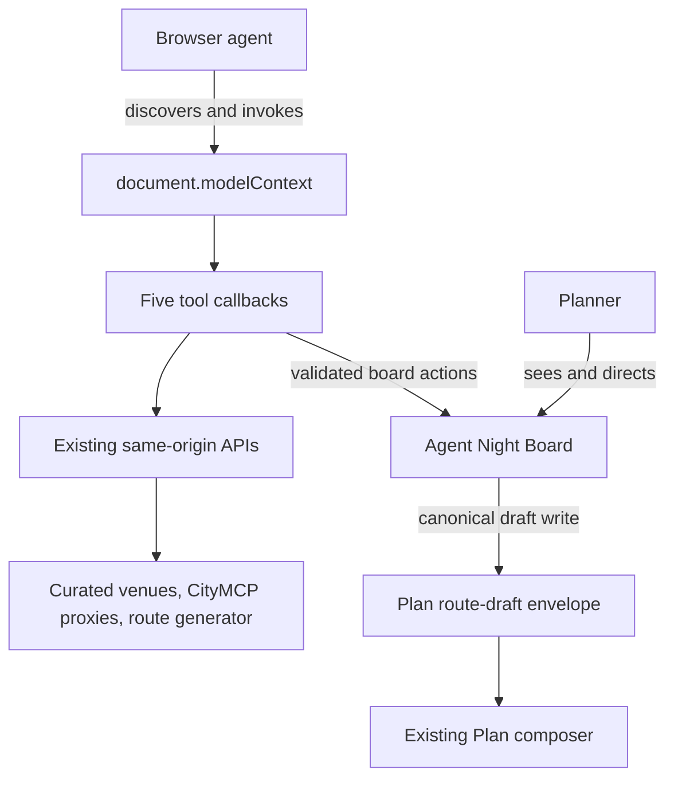
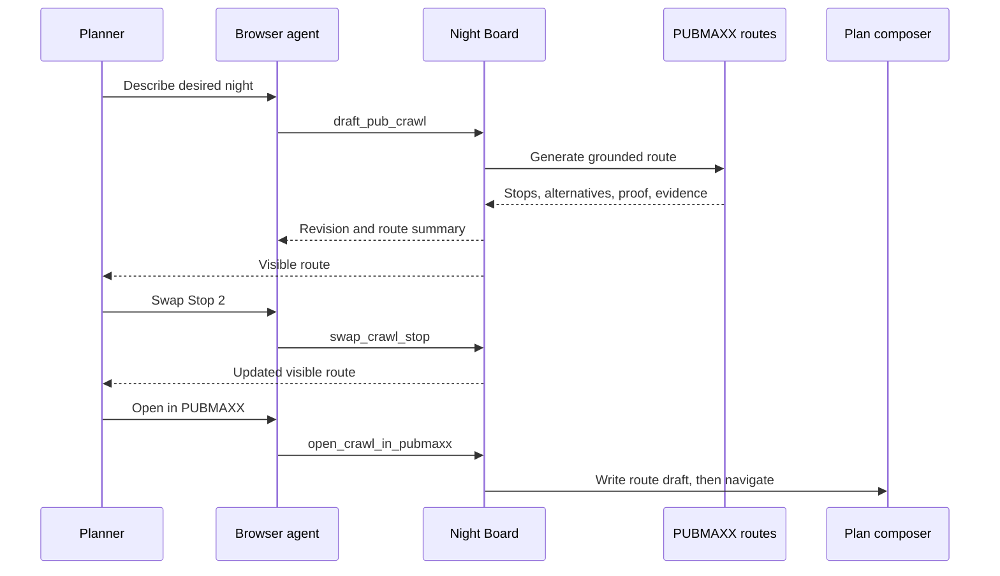
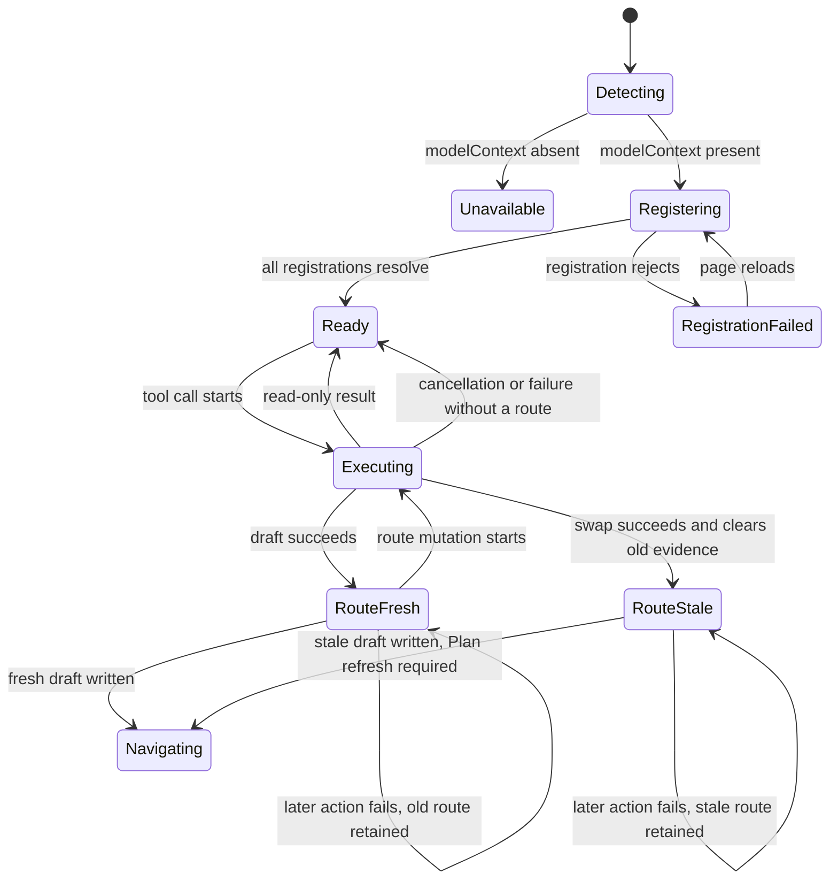

# feat: Add WebMCP Agent Night Board

## Goal Capsule

- **Objective:** A person and a browser agent can build, inspect, revise, and open one grounded PUBMAXX Crawl Route together on a visible shared surface.
- **Means:** Add a dedicated `/webmcp` Night Board that registers five narrow imperative WebMCP tools and reuses existing PUBMAXX search, London context, route generation, and Plan handoff contracts. (KTD1, KTD2)
- **Authority:** User-approved challenge design and challenge submission requirements outrank this plan. Existing PUBMAXX trust, price, route-grounding, privacy, voice, accessibility, and surface-navigation contracts remain authoritative.
- **Execution profile:** Implement feature and regression coverage test-first in one isolated branch. Use current official WebMCP imperative API guidance. Keep the app keyless.
- **Stop conditions:** Stop for any requirement that needs persistent user data, a new external provider, a database migration, a weakened route-grounding check, or a production deployment without captain approval.
- **Tail ownership:** Feature branch owns focused tests, quality gates, in-app-browser proof, challenge documentation, public snapshot preparation, push, pull request, and CI observation. Captain owns merge, production deployment, final video upload, and form submission.

---

## Product Contract

### Summary

Build a dedicated PUBMAXX Agent Night Board where a person keeps visible control while a WebMCP-capable agent searches curated pubs, reads tonight's London context, drafts a grounded Crawl Route, swaps one Stop at a time, and opens the final route in the existing Plan composer.

### Problem Frame

PUBMAXX already has strong planning APIs and browser handoff contracts, but an agent must currently operate the visual product as an unstructured series of clicks. That hides available actions, weakens input validation, and makes human-agent collaboration hard to inspect. WebMCP can expose the same trusted application logic as narrow browser-native tools while the Night Board shows each result to the person at the same time.

### Actors

- A1. **Planner:** Person who states the night, inspects evidence, accepts or changes Stops, and decides when to continue into PUBMAXX.
- A2. **Browser agent:** Agent in ChatGPT's in-app browser or compatible Chrome that discovers and invokes the registered tools.
- A3. **PUBMAXX planning service:** Existing keyless server routes that own curated venue search, London context, route selection, alternatives, route evidence, and grounding proof.

### Key Decisions

- **Dedicated Agent Night Board:** Keep WebMCP on `/webmcp`, chosen over global registration on every route so ordinary PUBMAXX pages do not gain unused tool registrations or bundle weight. (session-settled: user-approved - chosen over a site-wide WebMCP layer: a focused challenge surface is easier to understand, demo, and verify.) Governs R1, R2, R10.
- **Visible shared route:** Every route-changing agent action updates the on-page board, chosen over hidden tool-only state so person and agent work on the same artefact. (session-settled: user-approved - chosen over invisible agent state: collaboration must remain inspectable and reversible.) Governs R3, R6, R7, R8.
- **Existing PUBMAXX contracts:** Reuse current curated search, CityMCP proxy, route generation, and Plan draft handoff, chosen over a parallel challenge-only planner so challenge behavior stays grounded in product logic. (session-settled: user-approved - chosen over a new planner: duplicated route authority would drift from PUBMAXX.) Governs R4, R5, R6, R7, R8.
- **Keyless and ephemeral:** Keep Night Board state in the browser and require no sign-in, database write, or new provider, chosen over a durable shared object so judges can use the live URL immediately. (session-settled: user-approved - chosen over authenticated persistence: access friction would weaken judging and add no value to this demo.) Governs R2, R9, R10.
- **Separate public snapshot:** Publish a fresh single-commit public repository, chosen over exposing private repository history so judges receive functional source without historical secrets or internal branch metadata. (session-settled: user-approved - chosen over making the existing repository public: history disclosure is outside challenge need.) Governs R11, R12.

### Requirements

**Shared surface**

- R1. `/webmcp` must render a self-contained Agent Night Board in the existing PUBMAXX visual language on 390 by 844 and supported desktop widths, with direct controls for a person to draft, swap, and open the same route when no agent is present.
- R2. The board must show whether WebMCP is unavailable, registering, ready, or failed. A registration failure must keep manual controls usable, name reload as the recovery, and never imply that unsupported and failed are the same state.
- R3. The board must show current request, revision, ordered Stops, reasons, alternatives, route totals, confidence, warnings, and provenance when the server provides them. A dedicated evidence shelf must keep the latest search result and latest London context result visible together until the same tool replaces its own result, with explicit empty, stale, partial, failed, and retryable states.

**Agent capabilities**

- R4. `search_pubmaxx_venues` must search only the curated PUBMAXX venue index through its existing keyless API and return bounded results.
- R5. `read_london_night_context` must read current London status and opportunities through existing fail-soft CityMCP proxy routes, preserving stale and degraded evidence.
- R6. `draft_pub_crawl` must send a bounded natural-language request to the existing plan generator, require the board revision the caller inspected, update the visible board only after a valid current response, and leave the previous board intact on failure or revision conflict.
- R7. `swap_crawl_stop` must require the board revision the caller inspected, replace one named or indexed Stop only with a server-provided alternative, prevent duplicate venues, and update the visible board revision. A swap must clear the replaced Stop reason and all route-wide evidence derived from the old sequence, clear grounding proof and operation key, and mark the route stale.
- R8. `open_crawl_in_pubmaxx` must require the current board revision, refuse malformed or absent routes, and navigate to `/plan` only after a canonical V2 draft is written. A fresh generated route uses the existing generated-route transfer. A swapped route writes the exact stale Stop order through the existing route-draft envelope so Plan can hydrate it but must refresh before lock-in.

**Trust and resilience**

- R9. Every tool must use a narrow JSON Schema, bound input lengths and counts, pass tool cancellation to network work, return structured success or actionable failure content, and declare accurate read-only and untrusted-content annotations. CityMCP text must be projected to allowlisted fields with per-field and total-size caps, labelled as untrusted evidence, and never treated as an instruction or followed as a URL.
- R10. The feature must register no tools outside the top-level `/webmcp` document, must use one abort-owned registration lifecycle, and must add no WebMCP polyfill or client dependency.

**Submission readiness**

- R11. Repository must include challenge explanation, implementation notes, local and compatible-browser test instructions, a sub-three-minute demo script, and the exact live and source URL placeholders needed by the form.
- R12. Public snapshot must contain required source and assets, a detectable root open-source licence, third-party data notices, no private history, and no committed secrets.

### Key Flows

- F1. **Discover and understand**
  - **Trigger:** A2 opens `/webmcp` in a compatible browser.
  - **Actors:** A1, A2.
  - **Steps:** Page registers tools, board shows readiness, agent reads London context or searches curated pubs, and the evidence shelf retains the latest result from each read-only tool without changing the route. A later search replaces only search evidence; a later context read replaces only context evidence.
  - **Outcome:** A1 and A2 share grounded planning context.
  - **Covered by:** R1, R2, R4, R5, R9, R10.
- F2. **Draft and revise**
  - **Trigger:** A1 states a desired night and A2 invokes route drafting.
  - **Actors:** A1, A2, A3.
  - **Steps:** Existing generator returns a grounded route, board publishes a new revision, A1 inspects it, and A2 may swap a Stop through a provided alternative.
  - **Outcome:** Board holds one visible Crawl Route. A generated route is fresh with route-wide evidence; a swapped route is visibly stale and keeps only evidence that still describes its selected Stops.
  - **Covered by:** R3, R6, R7, R9.
- F3. **Continue in PUBMAXX**
  - **Trigger:** A1 accepts current route and asks A2 to open it.
  - **Actors:** A1, A2.
  - **Steps:** Tool validates current board, writes canonical Plan draft, returns handoff result, and moves browser to `/plan`.
  - **Outcome:** Existing Plan composer hydrates exact ordered route without a second generation request.
  - **Covered by:** R8, R9.
- F4. **Continue without an agent**
  - **Trigger:** A1 opens the board in an unsupported browser, sees a registration failure, or wants to act directly.
  - **Actors:** A1, A3.
  - **Steps:** A1 enters the request, drafts through the same generator action, chooses one unused server-provided alternative through the same swap action, and opens the route through the same canonical handoff.
  - **Outcome:** Agent absence never turns the shared board into a dead-end read-only demo.
  - **Covered by:** R1, R2, R6, R7, R8.

### Acceptance Examples

- AE1. **Unsupported browser:** Given `document.modelContext` is absent, when `/webmcp` loads, then board says WebMCP is unavailable and still renders its explanatory and empty-route states without an exception. Covers R1, R2.
- AE2. **Grounded draft:** Given a request for three cheap lively pubs in Clapham, when `draft_pub_crawl` succeeds, then board shows three unique Stops in response order plus route evidence and increments revision once. Covers F2, R3, R6.
- AE3. **Failed refresh:** Given board already shows a route, when a later draft request is rate-limited or unavailable, then tool returns actionable failure content and existing route stays unchanged. Covers F2, R6, R9.
- AE4. **Safe swap:** Given Stop 2 has alternatives and one alternative is already used by another Stop, when agent asks to swap Stop 2, then duplicate candidate is skipped and next unused server-provided alternative becomes Stop 2. Covers F2, R7.
- AE5. **No invented swap:** Given requested Stop has no unused alternative, when agent invokes `swap_crawl_stop`, then tool reports no available change and route revision does not change. Covers F2, R7.
- AE6. **Exact handoff:** Given board has a valid generated route, when agent invokes `open_crawl_in_pubmaxx`, then canonical route draft is written and `/plan` hydrates same Stop IDs and order. Covers F3, R8.
- AE7. **Cancelled network call:** Given browser cancels a context or generation tool while fetch is pending, when cancellation fires, then request aborts and board does not publish partial new state. Covers R6, R9, R10.
- AE8. **Registration failure:** Given `document.modelContext` exists and one registration rejects, when registration settles, then board shows failed rather than unsupported, keeps manual controls active, and offers reload as recovery. Covers R1, R2.
- AE9. **Revision conflict:** Given an agent inspected revision 2 and the person publishes revision 3 before its swap or handoff begins, when the agent action checks `expectedRevision: 2`, then it returns a retryable stale-revision result and changes neither board nor storage. Covers R6, R7, R8.
- AE10. **Untrusted context:** Given CityMCP returns directive-like or oversized text, when context tool completes, then output contains only capped allowlisted evidence, does not invoke another tool, and does not change route state. Covers R5, R9.

### Success Criteria

- ChatGPT's in-app browser discovers all five tools on live `/webmcp`, invokes them, and the person sees route changes on the same page.
- One recorded demo completes context, draft, swap, and Plan handoff in under three minutes without sign-in or secret configuration.
- Focused tests, lint, typecheck, repository verification, build, browser tests, hosted CI, and live tool proof are reported as separate evidence states.
- Public source URL opens without credentials and shows licence, WebMCP implementation, setup steps, and challenge explanation at repository top level.

### Scope Boundaries

**In scope**

- Top-level imperative WebMCP tools on `/webmcp`.
- Ephemeral browser board state and existing API calls.
- Exact Plan draft handoff.
- Challenge documentation, licence, third-party notice, demo script, and public source snapshot.

**Deferred to Follow-Up Work**

- Durable collaboration history, share links, or signed-in board recovery.
- Site-wide WebMCP coverage for Rounds, Pint Drops, Visit Reports, or Social.
- Analytics beyond existing consent-gated events.

**Outside this product's identity**

- A generic MCP server or remote agent backend.
- Agent authority to publish prices, moderation changes, or account data.
- Invented venue, price, opening, accessibility, or transport claims.

### Dependencies

- Compatible browser exposes current `document.modelContext.registerTool` imperative API.
- Existing `/api/venue-search`, `/api/citymcp/status`, `/api/citymcp/things-to-do`, and `/api/plans/generate` contracts remain available.
- Existing `transferGeneratedRouteToDraft` and Plan composer draft arbitration remain canonical handoff owners.

---

## Planning Contract

### Key Technical Decisions

- KTD1. **Register imperatively in one client component.** Use top-level `document.modelContext.registerTool` with one `AbortController` passed to each registration and aborted on unmount. Feature detection controls status only. No polyfill, iframe, declarative form, or experimental React wrapper. (session-settled: user-approved - chosen over a WebMCP package: native registration gives judges the exact required implementation and avoids dependency drift.) Governs R2, R9, R10.
- KTD2. **Keep one board store beside tool callbacks.** Tool callbacks and manual controls call the same actions and publish validated results into one reducer-owned store. Shared state, evidence shelf, execution state, and revision stay visible. (session-settled: user-approved - chosen over hidden tool memory: one visible artefact is the core collaboration benefit.) Governs R1, R3, R6, R7.
- KTD3. **Treat server route response as route authority and a Stop change as a freshness boundary.** Fresh draft stores validated response fields required by board and Plan transfer. Swap may select only an alternative returned by server, then must clear the replaced reason, route totals, confidence, warnings, grounding proof, and operation key and set `routeStale` before display or handoff. Governs R6, R7, R8.
- KTD4. **Return compact structured tool results through a data-only boundary.** Each execution returns a small JSON-compatible object with status, board revision, human-readable summary, stable IDs, and relevant evidence or retry data. CityMCP projection allowlists fields, caps each retained string and full result, labels third-party text as untrusted evidence, and never emits source text as instructions or follows source URLs. Governs R4, R5, R6, R7, R9.
- KTD5. **Use ordinary PUBMAXX navigation only after durable browser write.** Handoff validates and writes existing V2 route envelope first. A fresh generated route uses `transferGeneratedRouteToDraft`; a swapped route uses `writePlanRouteDraftEnvelope` with exact Stops, cleared authority, and `routeStale: true`. It reports failure without navigation when storage is unavailable. Successful navigation is scheduled after tool result construction so agent can receive completion. Governs R8.
- KTD6. **Publish source as fresh snapshot.** Export feature branch contents to a new repository with one initial commit after secret, asset, licence, and clean-clone checks. Do not connect public repository as a remote of private working checkout. Governs R11, R12.
- KTD7. **Serialize route mutations with revision preconditions.** Draft, swap, and handoff enter one client-only mutation queue, require `expectedRevision`, and capture a monotonic operation token. Search and London context stay outside that queue. A queued mutation rechecks its expected revision before network or side effects; an older queued action becomes a retryable stale-revision result instead of running against newer state. Before state publication, envelope write, or navigation, action must still match current token and revision or return without side effects. Governs R6, R7, R8, R9.

### Assumptions

- Challenge judges will use ChatGPT in-app browser or compatible Chrome with WebMCP enabled.
- Existing route generator's `query` input is enough for first challenge version; structured night fields remain owned by current generator inference.
- `swap_crawl_stop` accepts a one-based Stop position and `expectedRevision` because board renders ordered Stops and current revision.
- MIT will cover first-party code. OSM and other third-party datasets retain their existing licences and attribution through a root notice.
- Production deployment and final submission remain captain actions after PR review.

### High-Level Technical Design







### Output Structure

```text
app/webmcp/
  page.tsx
  webmcp.css
components/webmcp/
  WebMcpNightBoard.tsx
lib/webmcp/
  board.ts
  modelContext.ts
types/
  webmcp.d.ts
__tests__/
  webmcpBoard.test.ts
  webmcpRegistration.test.tsx
e2e/
  webmcp-night-board.spec.ts
docs/
  WEBMCP.md
  WEBMCP_SUBMISSION.md
LICENSE
THIRD_PARTY_NOTICES.md
```

Directory layout can contract during implementation when one module has no independent owner. Tests and contracts stay separate even if implementation files merge.

### System-Wide Impact

- **Agent parity:** High-value public planning reads and route creation gain structured agent access. Account, contribution, and moderation actions stay closed.
- **Route trust:** Existing generator and route draft remain sole owners. New surface must not recalculate or invent evidence.
- **Privacy:** Same-origin public reads only. No new viewer coordinates, identifiers, analytics, storage keys, or processors.
- **Performance:** Dedicated route contains registration bundle. No global layout import and no map bundle required.
- **Accessibility:** Board is semantic DOM parallel to agent tools, supports keyboard use, announces state changes without replacing visible error text, and keeps 44px controls.

### Risks and Mitigations

| Risk | Consequence | Mitigation |
|---|---|---|
| Draft API changes before deadline | Tool publishes malformed route or crashes | Validate at tool boundary, keep prior route, pin focused tests to observable response behavior |
| WebMCP draft API changes | Tools fail registration in judge browser | Use current native imperative API, AbortSignal lifecycle, local declaration only, and live in-app-browser proof |
| React callbacks close over stale board | Swap or handoff acts on old revision | Read current board through one state owner and include revision in every mutation result |
| Swap invalidates proof | Plan composer rejects or misstates route authority | Restrict to server-provided alternatives and verify exact Plan hydration in browser test |
| Public snapshot exposes private material | Security or licensing incident | Fresh one-commit export, secret scan, third-party notice, clean-clone inspection, no private history |
| Deadline pressure blurs evidence | Unverified feature is called shipped | Report focused tests, full local gate, CI, PR, deployment, live tools, and video as separate states |

### Sources and Research

- `app/api/venue-search/route.ts` and `lib/curatedVenueSearch.server.ts` own bounded curated venue search.
- `app/api/citymcp/status/route.ts` and `app/api/citymcp/things-to-do/route.ts` own fail-soft current London context.
- `app/api/plans/generate/route.ts` owns route selection, alternatives, evidence, operation key, and grounding proof.
- `lib/mapRouteTransfer.ts` and `lib/planRouteDraft.ts` own canonical browser handoff into Plan.
- `components/plan/PlanComposer.tsx` and `components/plan/PlanSummary.tsx` show existing generation and safe-alternative behavior.
- OpenAI WebMCP developer documentation: `https://learn.chatgpt.com/docs/webmcp`.
- Chrome WebMCP imperative API documentation: `https://developer.chrome.com/docs/ai/webmcp/imperative-api`.
- WebMCP draft specification: `https://github.com/webmachinelearning/webmcp`.

---

## Implementation Units

### U1. Establish WebMCP and board contracts

- **Goal:** Add typed native registration boundary and pure board transitions before UI integration.
- **Requirements:** R2, R3, R6, R7, R8, R9, R10; KTD1, KTD2, KTD3, KTD4, KTD7.
- **Dependencies:** None.
- **Files:** `types/webmcp.d.ts`, `lib/webmcp/modelContext.ts`, `lib/webmcp/board.ts`, `__tests__/webmcpBoard.test.ts`, `__tests__/webmcpRegistration.test.tsx`.
- **Approach:** Define minimum current API declaration, fixed tool names and schemas, result/error helpers, route response validation, board revision transitions, unused-alternative selection, and one mutation arbiter. Draft, swap, and handoff schemas require `expectedRevision`; action execution serializes, captures a monotonic token, and rechecks token plus revision before each side effect. Registration receives tool implementations from caller, registers all tools with one abort signal, and reports aggregate readiness without inventing availability.
- **Execution note:** Start with failing tests for unsupported browser, registration rejection, abort cleanup, duplicate-safe swap, invalid response, stale-route preservation, and overlapping route mutations.
- **Patterns to follow:** `lib/mapRouteTransfer.ts`, exact-key validation in `lib/planRouteDraft.ts`, and API error reading used by Plan composer.
- **Test scenarios:**
  - Given no model context, registration reports unavailable and creates no controller-owned tools.
  - Given five successful registrations, readiness becomes ready only after all promises resolve.
  - Given one rejected registration, readiness becomes failed and abort removes earlier registrations.
  - Given unmount, shared signal aborts once and pending registration or execution work can observe cancellation.
  - Given valid generated Stops, parser retains order, alternatives, proof, totals, confidence, warnings, and provenance.
  - Given invalid or empty Stops, parser rejects response and existing board value remains unchanged.
  - Given alternatives containing current route IDs, swap selects first unused candidate and increments revision once.
  - Given no unused alternative, swap returns unchanged board and does not increment revision.
  - Given two drafts enter the queue with the same expected revision, first success publishes the next revision and second returns stale before network work or side effects.
  - Given swap or handoff carries an old `expectedRevision`, action changes neither board nor storage.
- **Verification:** Pure contract tests prove tool lifecycle and board state without reading source text.

### U2. Build responsive Agent Night Board

- **Goal:** Render collaboration state in PUBMAXX visual language with complete mobile and desktop behavior.
- **Requirements:** R1, R2, R3; Key Decisions for dedicated board and visible shared route.
- **Dependencies:** U1.
- **Files:** `app/webmcp/page.tsx`, `app/webmcp/webmcp.css`, `components/webmcp/WebMcpNightBoard.tsx`, `__tests__/webmcpRegistration.test.tsx`, `e2e/webmcp-night-board.spec.ts`.
- **Approach:** Server page supplies metadata and static shell. Client component owns readiness, request, route, execution, and error states. Manual draft, per-Stop swap, and open controls call the same actions as tools. Evidence shelf has separate Search and London context regions; each keeps its last result until that tool replaces it and renders explicit empty, stale, partial, failed, and retryable states. Use semantic ordered list for Stops, concise evidence blocks, existing header/navigation patterns, visible focus, reduced motion, and 44px actions. Unsupported and registration-failed states keep manual actions available; failed names reload as recovery.
- **Execution note:** Render state fixtures first and measure 390 by 844 plus desktop before adding polish.
- **Patterns to follow:** Existing root tokens and legal/content surfaces, `docs/VOICE.md`, and mobile 44px geometry contracts.
- **Test scenarios:**
  - Unsupported state renders without crash and board content remains keyboard reachable.
  - Registration rejection renders failed state, reload recovery, and usable manual route controls.
  - Search and London context results coexist; a later search replaces only search evidence.
  - Empty, stale, partial, failed, and retryable read results have distinct visible states.
  - Ready state names five available capabilities without exposing internal JSON or source code.
  - Route state renders Stop order, reasons, alternatives, totals, confidence, warnings, and provenance supplied by fixture.
  - Long venue names and trust captions wrap without horizontal scrolling at 390px.
  - Focus order follows page order and all interactive targets meet 44px minimum.
  - Reduced-motion mode removes decorative transitions while preserving status changes.
- **Verification:** Component and browser assertions prove semantic content, responsive fit, keyboard focus, contrast, and no horizontal overflow.

### U3. Connect read-only search and London context tools

- **Goal:** Let agent gather bounded PUBMAXX and tonight context without changing board route.
- **Requirements:** R4, R5, R9; KTD1, KTD4.
- **Dependencies:** U1, U2.
- **Files:** `components/webmcp/WebMcpNightBoard.tsx`, `lib/webmcp/modelContext.ts`, `__tests__/webmcpRegistration.test.tsx`, `e2e/webmcp-night-board.spec.ts`.
- **Approach:** Register search and context tools with closed schemas. Forward execution abort signal to same-origin fetch. Bound search text and result count. Read status and opportunities in parallel. Project upstream data to allowlisted fields, cap each string and total rows and bytes, preserve stale and error fields, label retained third-party strings as untrusted evidence, and publish results to their own evidence-shelf regions. Never follow upstream URLs or transform upstream text into tool instructions.
- **Test scenarios:**
  - Two-character curated query returns bounded ordered venue IDs, names, and areas.
  - Too-short query is rejected before fetch with actionable tool error.
  - Context success returns as-of, weather, disrupted lines, signals, and opportunities without changing route revision.
  - One degraded context endpoint still returns available half plus explicit degraded field.
  - Both failed context endpoints return retryable failure rather than an empty-night claim.
  - Aborted tool call passes signal to each fetch and does not publish late UI state.
  - Directive-like and oversized CityMCP strings are capped as evidence, cannot change route state, and cannot trigger another tool.
- **Verification:** Mocked fetch tests assert requests and tool results. Browser proof invokes both tools through WebMCP and checks board status remains stable.

### U4. Connect draft, swap, and Plan handoff tools

- **Goal:** Complete collaborative route lifecycle through existing grounded planning contracts.
- **Requirements:** R3, R6, R7, R8, R9; F2, F3; KTD2, KTD3, KTD4, KTD5, KTD7.
- **Dependencies:** U1, U2.
- **Files:** `components/webmcp/WebMcpNightBoard.tsx`, `lib/webmcp/board.ts`, `lib/mapRouteTransfer.ts`, `__tests__/webmcpBoard.test.ts`, `__tests__/webmcpRegistration.test.tsx`, `__tests__/mapRouteTransfer.test.ts`, `e2e/webmcp-night-board.spec.ts`.
- **Approach:** Draft tool and manual action enter one mutation queue, verify `expectedRevision`, call existing generator with bounded query, and publish only a validated current response. Swap verifies revision, selects one unused provided alternative, clears old-sequence evidence and authority, and marks route stale. Handoff verifies revision, uses existing generated-route transfer for fresh drafts or writes exact stale Stops through `writePlanRouteDraftEnvelope` for swapped drafts, requires canonical V2 success, and schedules `/plan` navigation only on success. Preserve previous route across generation, storage, revision, or navigation preparation failures.
- **Execution note:** Drive generator failure, duplicate alternative, stale-evidence clearing, revision conflict, storage refusal, cancellation, and exact fresh and swapped Plan hydration before implementation.
- **Test scenarios:**
  - Covers AE2. Valid three-Stop response becomes visible revision 1 and tool result returns same ordered venue IDs.
  - Covers AE3. Failed second draft returns failure and leaves first route plus revision unchanged.
  - Covers AE4. Swap skips alternative already present elsewhere, publishes first unused venue at same position, clears old-sequence evidence and authority, and marks route stale.
  - Covers AE5. Stop without unused alternatives returns no-change result and stable revision.
  - Covers AE6. Successful handoff writes V2 draft with exact Stops and navigates to `/plan` after success result is available.
  - Storage exception or invalid draft prevents navigation and returns actionable failure.
  - Covers AE7. Aborted generation never overwrites a newer successful revision.
  - Covers AE9. Old revision or operation token cannot publish, write storage, or navigate.
  - A swapped stale route hydrates exact IDs and order in Plan, shows refresh need, and cannot lock until refreshed.
- **Verification:** Unit tests prove transitions and storage boundary. End-to-end browser test proves exact route survives `/webmcp` to `/plan`.

### U5. Document implementation and submission story

- **Goal:** Make judging, local setup, review, and demo recording possible without private context.
- **Requirements:** R11, R12.
- **Dependencies:** U2, U3, U4.
- **Files:** `README.md`, `docs/WEBMCP.md`, `docs/WEBMCP_SUBMISSION.md`, `LICENSE`, `THIRD_PARTY_NOTICES.md`, `__tests__/legalPages.test.ts` or a focused repository-contract test when needed.
- **Approach:** Add exact WebMCP code snippet, compatible-browser steps, tool inventory, architecture, keyless run instructions, trust boundaries, challenge answers, live/source placeholders, and timed video script. Add root MIT licence for first-party code and preserve existing ODbL and other third-party terms in notice. Do not claim deployment, live proof, public repository, or video before each exists.
- **Patterns to follow:** Root README quick start, `docs/VOICE.md`, existing data attribution docs, and challenge wording supplied by user.
- **Test scenarios:**
  - Fresh reader can identify all five tools, start keyless app, open `/webmcp`, and test in supported browser from top-level docs.
  - Submission copy answers why WebMCP fits, user experience benefit, new human-agent collaboration, and implementation approach.
  - Demo script covers problem, live tool discovery, context, draft, swap, handoff, and source in under three minutes at spoken pace.
  - Root licence is detectable while third-party notice does not relicense OSM-derived data.
  - Documentation contains no private URL, credential, internal worktree path, unsupported claim, or em dash.
- **Verification:** Link and text audit, licence review, fresh-clone setup rehearsal, and human read-through of timed script.

### U6. Prove and package challenge release candidate

- **Goal:** Produce separate source, browser, hosted, and public-repository evidence for captain review.
- **Requirements:** R1 through R12; all acceptance examples.
- **Dependencies:** U1, U2, U3, U4, U5.
- **Files:** `e2e/webmcp-night-board.spec.ts`, `docs/proof/webmcp/README.md`, `docs/proof/webmcp/` captured assets, public repository snapshot outside private git history.
- **Approach:** Run focused tests, lint, typecheck, full repository verification, isolated build, and headless e2e under resource gate. Use Codex in-app browser for interactive WebMCP discovery and the full human-agent flow. Capture mobile and desktop proof. Export one clean snapshot to new public repository only after secret and licence checks. Open PR in private source repo and observe hosted CI. Leave production deployment, video upload, and form submit for captain.
- **Test scenarios:**
  - Compatible in-app browser discovers exactly five tool names and schemas on top-level `/webmcp`.
  - Read-only tools complete without route revision change.
  - Draft and swap change visible route and return matching revisions.
  - Open tool hydrates exact route in Plan composer.
  - 390 by 844 and desktop captures show no overlap, clipping, or unreadable trust copy.
  - Fresh public clone installs, passes focused WebMCP tests, and builds keyless.
  - Secret scan finds no credentials, private git history, internal worktree paths, or private-only remotes.
- **Verification:** Evidence ledger records source audit, focused local tests, full local gate, browser proof, PR, CI, public snapshot, production, video, and submission as separate states.

---

## Verification Contract

| Gate | Scope | Applies to | Done signal |
|---|---|---|---|
| Focused Vitest | WebMCP board, registration, transfer | U1, U3, U4 | New behavioral tests pass and reproduce failure preconditions |
| `npm run lint` | Repository lint | U1-U5 | No lint errors or warnings introduced or observed |
| `npm run typecheck` | TypeScript contracts | U1-U5 | Native WebMCP declaration and app compile without casts hiding invalid input |
| `npm run verify` | Data, lint, typecheck, coverage, audit | U1-U6 | Full pre-push gate passes in isolated worktree |
| `npm run ci:isolated` | Full production build | U6 | Keyless production build completes with isolated Next output |
| Repository Playwright test | Route UI and Plan handoff | U2, U4, U6 | End-to-end scenarios pass in owned headless harness |
| Codex in-app browser | Native WebMCP and visual proof | U3, U4, U6 | Five tools discovered and full context-draft-swap-handoff flow succeeds |
| GitHub PR CI | Hosted integration | U6 | Required checks complete successfully on pushed branch |
| Public fresh clone | Submission source | U5, U6 | Clone is public, licenced, keyless-functional, and contains no private history |

Browser proof must test 390 by 844 and one desktop width. Interactive proof uses Codex in-app browser only. Headless Playwright stays limited to repository-owned tests. Do not replace native tool discovery with source-text assertions.

---

## Definition of Done

- R1-R12 and AE1-AE10 have observable evidence.
- All five tools register through native imperative WebMCP with accurate schema, annotations, cancellation, and cleanup.
- Person sees every search, context, and route result on one accessible board, can use equivalent manual controls, and can continue with exact route in Plan.
- Overlapping route mutations cannot overwrite newer state, write an old draft, or navigate from an old revision.
- A swapped route never presents old route-wide evidence as current and reaches Plan as stale until refreshed.
- Third-party CityMCP text remains capped untrusted evidence and cannot steer tool execution.
- Existing generator and draft contracts remain sole route authority.
- App works keyless and adds no new dependency, database table, environment variable, processor, or auth gate.
- New tests fail against missing feature and pass after implementation. No source-content-only test stands in for behavior.
- Focused tests, lint, typecheck, `npm run verify`, isolated build, end-to-end tests, in-app-browser proof, PR CI, and public fresh-clone proof are green or reported honestly as blocked.
- README, implementation guide, submission copy, licence, third-party notice, and under-three-minute demo script are complete.
- Public repository contains one clean snapshot commit and no private history or secrets.
- Pull request is open with implementation and evidence summary. Production deployment, YouTube upload, and form submission remain explicitly unclaimed until captain completes them.
- Abandoned experiments, unused helpers, duplicate tool owners, generated scratch files, and stale proof assets are absent from final diff.
