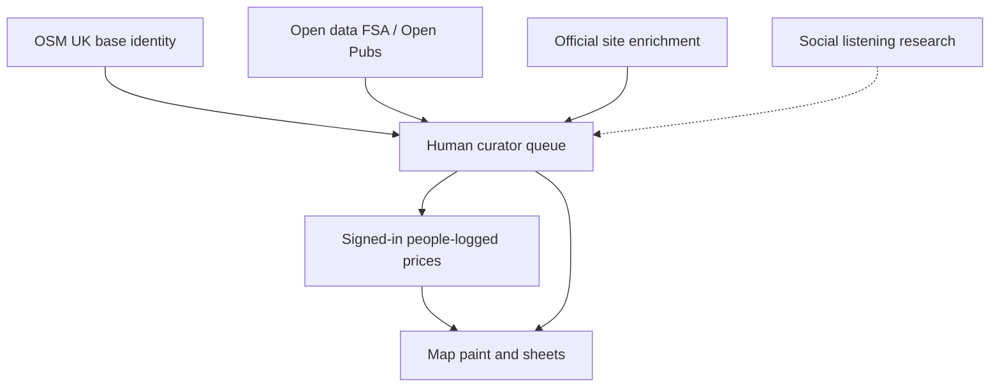

# First principles: outings, story, and the data stack

> Next-phase strategy for PubMaxxing, **separate from** the landing acquisition wave ([`LANDING_ACQUISITION.md`](./LANDING_ACQUISITION.md)) and the PLG / invite monopoly plan ([`PLG_STRATEGY.md`](./PLG_STRATEGY.md)).
>
> Status: **WAVES S1–S4 LANDED on this branch** — story (`/about`), landing why-beat, occasion chips + coffee taxonomy + migration `0082`, source ledger + Open Pubs dry-run. Captain still applies migrations. Optional follow-ups: owner biography dump to deepen `/about`, Open Pubs match report on full UK CSV, Skiddle commercial approval.
>
> Drafted 2026-08-07 from shipped product, `docs/VOICE.md`, live `/` + `/about`, existing data pipelines (OSM UK base, FSA hygiene, Wetherspoons first-party fence, Tavily official-site enrichment), UK going-out market research, and open-data / competitor mapping.

---

## 0. What you asked for, translated into buildable truth

You want three things that sound like one product, but they are three systems:

1. **Taste and story.** Homepage and Our Story should feel human and natural (Gen Z-readable without cosplay), explain *why* this exists, and show the real effort behind it — not brochure AI-slop.
2. **Broader usefulness.** Not only “where shall we drink,” but food, coffee, a quiet seat in a Wetherspoons, a chill afternoon. People who go out to *be out*, not only to get pints.
3. **Best-in-class pub intelligence.** Gather every useful signal the internet will legally and honestly give us, then turn it into the default app for deciding where to go.

This plan answers all three from first principles. It deliberately does **not** reopen the locked landing CTA hierarchy or invite k-factor work already sequenced elsewhere.

---

## 1. First principles (Thiel + Musk, applied correctly)

### The monopoly question (Thiel)

Do not compete as “another pub finder.” Google already owns maps. Untappd owns beer check-ins. Tripadvisor owns reviews. CAMRA / WhatPub owns volunteer real-ale catalogues.

**Own this:** the system of record for *honest, attributable prices and outing facts on UK pubs*, starting in London, that turns into a shareable night (or afternoon) without an account.

The secret is not “we scraped more.” The secret is **provenance you can defend**: named publisher or people-logged day, corroboration before paint, never pay-to-rank. That is the moat. Everything else is distribution around it.

### The physics question (Musk)

Strip the product to the hard constraint:

> For a person standing on a pavement at 5:40pm (or 11am with a laptop), can we answer “where should we go, and what will it cost” with figures that survive a challenge?

That constraint has a physics stack:

| Layer | Hard thing | What we already ship | What is still soft |
|---|---|---|---|
| Identity | Every pub has a stable id | Curated slim index + UK OSM base shards | Base → curated promotion path |
| Price truth | Venue × drink × time with source | Community corroboration, drink lenses, Pint Index | Coverage density; coffee/food as first-class lenses |
| Occasion | Match the *kind* of going out | Plan, Tonight, soft-drink / alcohol-free lenses | Daytime / food / chill / Spoons coffee jobs |
| Distribution | Artifact friends open without login | Plan invite | WhatsApp-first share (PLG Wave 1) |
| Trust voice | Copy that sounds like a mate | `docs/VOICE.md` fences | Founding narrative still reads thin / policy-first |

Delete anything that does not serve this stack. A viral feed is optional. Honest prices on a map that becomes a shared plan is not.

### The anti-slop rule (taste)

“Gen Z” here does **not** mean slang packs, emojis, or youth mode. `docs/VOICE.md` already bans that: one voice for a 22-year-old and a 45-year-old; British pub language; no banned marketing words; no em dashes; no exclamation marks.

What people are reacting to as “AI slop” is usually:

- Policy before desire (“we name the source when there is one…”) as the first breath
- Abstract founding story (“we got tired of that”) with no concrete effort, decisions, or scars
- Feature grids that list capabilities instead of showing one useful night
- Perfect, symmetrical, brochure rhythm instead of how people actually talk when they are deciding where to go

Fix the *human specificity*, not the brand laws.

---

## 2. Diagnosis of what is live today

### Homepage (`components/landing/LandingPage.tsx`)

Shipped strengths:

- Map-first CTA hierarchy (flag-off) already points cold traffic at the product
- Honest stats from `lib/aboutStats` (no invented users)
- DrinkGlyph / ThamesHero IP and price-band teaching

Gaps for this plan’s goals:

- Hero still leads with pint cost → price policy. Correct for the monopoly, thin for “why we built this for you”
- No founding / effort beat on `/` (only product signals + memory steps)
- Occasion language is night-crawl skewed; coffee / food / chill barely appear
- “From a pin to a story” and Social CTAs compete with the sharper job: decide where to go in under a minute

### Our story (`app/about/page.tsx`)

Shipped strengths:

- Clear problem framing (Maps → reviews → ChatGPT → same pub)
- Ethos list matches the honesty wall
- Traction numbers are real and computed

Gaps:

- “Why we built it” is generic startup fatigue, not *your* back-and-forth: the nights you overpaid, the spreadsheet phase, the arguments about corroboration vs speed, the London-first bet
- “Who it’s for” still centres drinkers; food, coffee, sober hangs, Spoons-as-third-space are missing
- Press kit one-liner still frames only pints

### Product already wider than the story admits

The codebase is ahead of the marketing:

- Soft-drink and alcohol-free categories + map lenses (`lib/drinks.ts`, `lib/mapExperienceLens.ts`)
- Food anchors on experience views (never on pin figures — correct)
- Community venue signals (character, access, door, eating)
- Visit reports (one visit, not a rating)
- FSA food hygiene overlay
- Wetherspoons directory + first-party web fence (`lib/wetherspoons.ts` — honest: web menus do **not** yield per-pub prices today)
- Tavily official-site enrichment (robots-aware, licence-tagged)
- UK base layer (~country-wide OSM pubs) separate from curated priced index

So the expansion is not “become a restaurant app.” It is: **tell the truth about the outings product we are already halfway building**, then densify the missing occasion lanes.

---

## 3. Market reality (why broader outings is not dilution)

UK pubs are under outlet pressure but still growing in value terms; visits skew social, health-conscious, and experience-led (Lumina / Mintel / trade press through 2025–2026). Gen Z still go to pubs, but often:

- Drink less, or zebra-stripe alcohol / no-alcohol
- Treat the pub as a daytime third space (coffee, food, laptop, catch-up)
- Care about cost, vibe, and “can we actually sit” as much as the lager

That supports a concentric expansion:

```text
London pint price truth (monopoly wedge)
    → alcohol-free / soft drink price truth (already gated like beer)
        → coffee + food anchors with real provenance (next)
            → chill / quiet / Spoons-as-daytime jobs in Plan + Map
                → only then city expansion that inherits the same honesty
```

If we lead with “everything about going out” before London pint density is obvious, we become Google with worse reviews. If we keep saying “pints only” while Gen Z opens Spoons for a coffee, we look like last decade’s night out.

---

## 4. North star for this phase (separate from PLG)

**PLG north star stays:** drinkers open PubMaxxing when deciding where to drink, and send a night link that pulls the crew in without an account.

**This phase’s north star:**

> A stranger lands on `/` or `/about`, feels a real team built this for people like them, opens the map, and can answer either “cheap pint near me” *or* “quiet coffee / food / chill spot that will not mug me,” with source-honest figures.

Weekly scoreboard additions (do not replace PLG metrics):

1. `/about` → map open rate
2. Non-pint lens usage share (soft-drink, alcohol-free, future coffee)
3. Plan generations whose free-text mentions food / coffee / chill / sober (qualitative sample + tag)
4. Cold visitor 5-second comprehension (manual + session replay sample): “what is this?” answered without reading the footer

---

## 5. Workstreams (owner picks which to open)

### Wave S1 — Human story and anti-slop voice (must, docs + copy)

**Job:** Make `/` and `/about` feel built by people who actually go out, not generated by a brand deck.

**Do**

1. **Founding narrative rewrite on `/about`** in VOICE, with concrete beats the owner supplies (do not invent):
   - The overpay / admin night that started it
   - The ugly early artifact (spreadsheet, Notion, group chat chaos)
   - The hard product fights: corroboration vs “just show every price,” London-first vs UK spray, no pay-to-rank
   - What you refused to ship
   - Who is building it (names, roles, one line each — team of people, not “we”)
2. **Landing: one human beat** between hero and feature grid. Not a mission statement. Something like the effort + the promise in two short paragraphs, linking to `/about`. Desire first; honesty second breath (already the landing-acquisition rule).
3. **Press kit + who-it’s-for** expanded to daytime / food / coffee / chill without banned words.
4. **Voice fence tests** extended: no new em dashes, no exclaims, no fake counts, no “journey / unlock / seamless.”

**Do not**

- Add Gen Z slang packs, emoji rows, or a second “youth” tone
- Invent testimonials, Discord member counts, or “thousands of nights”
- Fight `docs/VOICE.md`; use it as the anti-slop governor

**Owner input required before copy lands**

A short voice note or bullet dump covering: origin story, failed approaches, team names, one scar you are proud of, one thing you will never do. Agents must not invent biography.

**Done when:** a cold reader can retell *why PubMaxxing exists* in one sentence that mentions a real human reason, not “democratising fair pricing.”

---

### Wave S2 — Occasion expansion: useful beyond the pint (product)

**Job:** Make food, coffee, chill, and sober hangs first-class *jobs*, without lying on pin colour or inventing coffee prices.

**Principles (locked to existing contracts)**

- Pint Index, cheapest-pint buckets, and default pin paint stay beer-led unless a drinker picks another lens
- Coffee / food never masquerade as pint authority
- Soft-drink and alcohol-free already share trust policy; coffee should join the taxonomy only with a migration + lens decision
- Demo prices never seed empty coffee/food views

**Build sequence**

1. **Occasion chips in Plan describe-first** — “Coffee and a catch-up,” “Food then a soft drink,” “Quiet Spoons,” “Alcohol-free crawl,” beside existing night chips. Same keyless generate path; copy in VOICE.
2. **Map discover / persona language** — surfaces that still say “night out” only get a twin for daytime where the data can answer. Empty stays explicit.
3. **Coffee as a submit + lens candidate** — add to drink taxonomy only after: category noun, map-lens yes/no decision (likely yes if it can label a pin honestly), CHECK migration, composer + corroboration reuse. Until density exists, do not market “coffee prices city-wide.”
4. **Food stays experience / sheet, not pin figure** — keep food anchors with source metadata; improve sheet + Plan food stops; never print food £ on the pint pin.
5. **Wetherspoons as a daytime product story** — use `lib/wetherspoonsDirectory` for “Spoons near me” / chill filters where identity is solid. Do **not** reverse the Order & Pay app for prices (existing first-party fence in `lib/wetherspoons.ts`). If JD Wetherspoon ever publishes structured web prices, the parser is already ready; until then, community + honest “menu link” beats fake £3.49 stamps.
6. **Quiet / chill signals** — lean on visit-report crowd/noise + community character signals already in tree; do not invent a new rating system.

**Done when:** a user can complete a coffee/food/chill plan keyless in a low-constraint area, and the UI never claims a coffee price it cannot source.

---

### Wave S3 — Data stack: “every pub,” done like adults (must for “best app”)

**Job:** Maximise coverage and freshness under licence, robots, and provenance rules. This replaces the fantasy of scraping X / Instagram / the whole internet into the price graph.

#### What we will not do

| Temptation | Why it is out |
|---|---|
| Scrape X / Instagram / TikTok for prices | ToS, brittle, unverifiable, often wrong; not a price authority |
| Reverse Wetherspoons Order & Pay | Explicitly fenced; private app backend |
| Scrape WhatPub / Untappd / Tripadvisor as if open data | Proprietary catalogues; CAMRA data is volunteer IP |
| Dump social vibes into pin colour | Breaks the honesty monopoly |

Social media is a **lead and research** channel (what people complain about, which pubs trend), not a write path into `community_prices`.

#### Legal / high-leverage stack (priority order)

| Priority | Source | Use | Status in repo |
|---|---|---|---|
| P0 | Community submit + corroboration | Live price authority | Shipped |
| P0 | Curated London slim index | Product pins, search, crawls | Shipped |
| P0 | OSM UK base shards | Country canvas, provisional marks | Shipped |
| P1 | FSA hygiene open data | Food-safety context on sheets | Shipped (`lib/foodHygiene.ts`) |
| P1 | Open Pubs (FSA-derived CSV) | Cross-check names/locations vs OSM | Dry-run scaffold (`scripts/evaluate_open_pubs.mjs`); ledger in `docs/data/SOURCE_LEDGER.md` (no auto-merge) |
| P1 | Tavily official-site enrichment | First-party menus where robots allow | Shipped scripts |
| P1 | Chain first-party pages (GK, Nicholson’s, etc.) | Priced rows only when extractable | Partial / harvest lanes |
| P2 | Ticketmaster / Skiddle (approved) | Tonight events, not prices | Researched; Skiddle needs commercial OK |
| P2 | Historic England / Wikipedia citations | Heritage, already cited | Shipped |
| P3 | Licensed social firehoses / brand APIs | Trend radar for curation queues | Not started — research only |
| P3 | Pub–landlord partnerships | Official menu feeds | BizDev, not scrape |

#### Operating model for densification



1. **Identity first.** Match every candidate to curated id or `venue-uk-*`. Never create orphan price rows.
2. **Official before social.** Tavily / first-party pages for menus; social only queues “go check this pub.”
3. **People close the loop.** Corroboration remains the paint gate for community authority.
4. **Borough campaigns.** One borough at a time for coffee/AF/soft-drink density — same as PLG Wave 2, extended categories.
5. **Publish what failed.** Keep the Wetherspoons honesty: if the web has no price, say so in ops docs; do not fake rows.

**Done when:** London has measurable week-on-week growth in corroborated coverage for at least two non-pint categories, and the ingest ledger lists every source with licence + refusal reasons.

---

### Wave S4 — Taste of usefulness (design, not rebrand)

**Job:** First viewport and story surfaces show *outings*, not a SaaS feature grid.

Constraints (from product design rules + existing system):

- Stay inside candle coral / night ink tokens; do not invent a purple or cream-DTC look
- Brand first; one composition; product visual over atmosphere collage
- No card soup in the hero; jokes off figures and dates
- Show a real map truth moment (bands, a real empty state, a Spoons daytime example) rather than stock lifestyle

This wave is a taste pass on S1/S2 copy and hierarchy, not a parallel redesign track to landing-acquisition. Coordinate so two agents do not fight `LandingPage.tsx`.

---

## 6. Sequencing vs existing plans

| Plan | Owns | This plan |
|---|---|---|
| `LANDING_ACQUISITION.md` | Map-first CTA, ThamesHero honesty, first-map orientation | Does not reopen; may add a human beat *after* hero once acquisition PR is stable |
| `PLG_STRATEGY.md` | Invite k-factor, price flywheel, lot density | Shares data flywheel; adds non-pint categories and story surface |
| This file | Story humanity, occasion expansion, legal data stack | New |

Suggested owner order if all three goals matter:

1. **S1** story/voice (fast, needs your biography dump)
2. Finish / protect landing-acquisition + PLG Wave 1 (distribution)
3. **S3** data densification ops (continuous)
4. **S2** occasion expansion once coffee taxonomy + one borough seed exist
5. **S4** taste pass as S1/S2 land

---

## 7. Competitive map (so we do not accidentally become them)

| Player | They own | We do not copy | We take |
|---|---|---|---|
| Google Maps | Default navigation + reviews | Star ratings as truth | Faster “what will it cost” |
| Untappd | Beer check-in social | Feed-first identity | Price + plan artifact |
| Tripadvisor | Tourist reviews | Review SEO sludge | Local honesty + crew plan |
| CAMRA WhatPub | Volunteer real-ale depth | Scraping their DB | Respect; cite; partner if ever offered |
| TheFork / Resy | Restaurant booking | Reservations platform | Pub-native outings |
| Partiful / Calendly | Invite UX | Empty event pages | Plan invite with priced stops |

---

## 8. Explicit anti-goals

- Do not ship a “scrape Twitter for pints” pipeline
- Do not reverse private chain apps for menus
- Do not widen pin paint to uncorroborated social claims
- Do not rebrand into a generic “discover nightlife” app
- Do not add Gen Z cosplay that fails the VOICE joke bar
- Do not invent founder mythology in copy
- Do not expand to ten cities to look big before London outing density is obvious
- Do not let food or coffee figures enter pint buckets or the Pint Index

---

## 9. Research appendix (sources used)

- Shipped surfaces: `components/landing/LandingPage.tsx`, `app/about/page.tsx`, `docs/VOICE.md`, `PRODUCT.md`
- Existing plans: `docs/plans/LANDING_ACQUISITION.md`, `docs/plans/PLG_STRATEGY.md`
- Data fences: `lib/wetherspoons.ts`, `public/data/uk_base/README.md`, `docs/EVENT_SOURCES_RESEARCH_2026-07-18.md`, Tavily enrichment tests/scripts, FSA open data
- Open Pubs: https://www.getthedata.com/open-pubs (FSA + ONS derived)
- FSA ratings open data: https://ratings.food.gov.uk/open-data
- UK going-out / Gen Z pub behaviour: Mintel pubs & bars 2025, Lumina UK Pub & Bar Market Report coverage in trade press (Morning Advertiser 2026), Greene King / Arc Inspirations Gen Z experiential reporting, Drinkaware moderation trends via secondary press
- Wetherspoons: first-party web has identity + PDF menu links, not per-pub structured prices; unofficial app reverse-engineering exists in the wild and is **rejected** here

---

## 10. Owner decisions needed

Reply with choices; implementation starts only after these:

1. **Biography dump for S1** — origin, team, scars, refusals (bullet points fine).
2. **Open waves:** S1 / S2 / S3 / S4 — which combination first?
3. **Coffee taxonomy:** approve adding `coffee` (or tea-and-coffee) to `lib/drinks.ts` + migration, or keep coffee as a Plan occasion without map prices for now?
4. **Open Pubs ingest:** green-light evaluation PR against OSM identity, or park?
5. **Skiddle commercial email:** still wanted for Tonight pub-scale events?

---

## 11. One-line summary

Stop sounding like a policy PDF, start sounding like the people who built the honest map; widen the job from “pint night” to “going out without guessing”; densify data through licence and corroboration, not fantasy scrapers — that is how this becomes the best app, not another AI-shaped directory.
