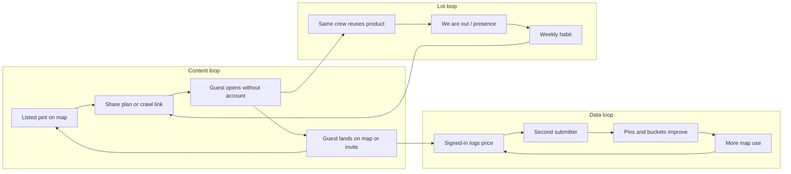

# cursorplan.md

> PubMaxxing product-led growth and network monopoly plan.
> First-principles strategy from shipped product, open PRs, live site review, and PLG / Thiel framing.
> Status: **READY FOR REVIEW** — build scope deferred until you say what to implement next.
> Related: [`cursorreview.md`](./cursorreview.md) (post-merge defect ledger), landing acquisition execution on PR [#787](https://github.com/Singularityszn/pubmax/pull/787).

---

## Honest answers first

**Are you building something useful?** Yes, for a real pain: London drinkers pay £6–£8 for a pint with no honest, comparable, map-native record. The curated map, community corroboration model ([docs/adr/0010-community-price-trust.md](docs/adr/0010-community-price-trust.md)), plan→invite without an account, and Pint Index are useful. Usefulness is not the same as spontaneous signup or virality.

**Will people naturally sign up?** Not at scale yet. The map and plan work keyless. Signup is mostly a tax for logging prices, claiming a handle, or Social. X works the opposite way: the product *is* the identity graph. PubMaxxing’s aha moment today is “I found a cheaper pint / I sent the night to my mates,” not “I created an account.”

**Will they share and pull friends in?** Sometimes, when the artifact is the night (plan invite, crawl link, RSVP page). Rarely, when the ask is “join another social app.” UK nights already live on WhatsApp. In-app Social is live by default and returns to preview only at `PUBMAX_SOCIAL_FRIENDS_LAUNCH=0`. Your strongest built viral path is Calendly/Partiful-shaped (share a link that works without login), not X-shaped (post into a feed strangers scroll).

**Thiel, applied correctly:** “Competition is for losers” does not mean ignore Google Maps / Untappd / Tripadvisor. It means do not compete as “another pub finder.” Own a category so specific it has no close substitute: **listed London pint prices with honest provenance, on a map that turns into a shareable night for a crew.** Start small (London drinkers who plan nights and hate guessing prices), dominate that, expand in concentric circles (more boroughs → more cities → more night types). Moats to stack: proprietary price graph + corroboration rules, brand (“Pubmaxxing”), WhatsApp distribution of night artifacts, denser local data than anyone else.

**X is the wrong north-star metaphor for v1.** X is an attention monopoly. You do not win by cloning feeds, DMs, and crews first. You win by becoming the **system of record for pint prices** and the **default shared object for tonight’s route** — then a private lot graph becomes inevitable.

---

## What you have vs what growth needs

| Asset already shipped | Growth role | Gap |
|---|---|---|
| Map + honest price lanes | Core utility / aha | Landing undersells (PR [#787](https://github.com/Singularityszn/pubmax/pull/787)); cold map is dense |
| Plan + `/invite/[token]` RSVP | Collaboration virality | Hardening merged in [#800](https://github.com/Singularityszn/pubmax/pull/800); k-factor not yet the product obsession |
| Pint Index + OG cards | Press / content virality | Must convert to map with intent (`components/pintindex/PintIndexArrival.tsx`) |
| Community prices (2-person corroboration) | Data network effect | Cold-start: uncorroborated prices do not paint pins |
| ShareBar / WhatsApp builders | Distribution | Sharing is available; not forced at the moment of value |
| Social / crews / presence / referrals | Identity network | Live by default; `=0` is emergency rollback; referral marks confer nothing; densifies *after* loops A/B work |
| PostHog funnels ([docs/METRICS_FUNNEL.md](docs/METRICS_FUNNEL.md)) | Measurement | Instrument invite k-factor and price flywheel as weekly operating metrics |

**Unknown factors you must treat as risks, not vibes**

1. **Chicken-egg on map paint** — corroboration is correct trust; it slows the visible flywheel.
2. **WhatsApp is the real social OS** — winning means winning inside WhatsApp threads, not replacing them.
3. **Ops readiness** — soft launch: Social live by default with an explicit `=0` rollback, CI Actions historically broken (#747), migrations owner-applied, and moderators tracked in the runbook ([docs/SOFT_LAUNCH_RUNBOOK.md](docs/SOFT_LAUNCH_RUNBOOK.md)).
4. **Trust decay** — stale or thin prices kill share-worthiness faster than missing Social features.
5. **Seasonality / weather** — nights out are weekend- and weather-skewed; weekly metrics need daypart awareness.
6. **Safety / presence** — “who’s out” can feel stalky; keep it lot-scoped and deliberate.
7. **Spam on handle-free RSVP** — public invite writes need caps (see [cursorreview.md](cursorreview.md) F9–F10).
8. **Substitutes** — Google may show prices; Untappd owns check-ins; CAMRA owns real ale. Your wedge is **honest listed price + crawlable night**, not reviews.
9. **Signup timing** — gate account creation after value, not before.
10. **City expansion temptation** — multi-city without London density dilutes the monopoly.

---

## North star and operating metrics

**North star (one sentence):**  
*London drinkers open PubMaxxing when deciding where to drink, and send a night link that pulls their crew in without an account.*

**Weekly scoreboard (already mostly instrumented)**

1. Invite **k-factor**: `invite_created` × conversion via `invite_redeemed` / RSVP engagement
2. **Corroborated pint coverage** density (borough / Night Area), not raw submissions
3. **Meaningful Pubmaxxers** (plan accepted/saved/completed, memory, story — from funnel doc)
4. Pint Index → map reach rate
5. Return: `activity_pulse` second-session rate (press target >2% is a floor, not a goal)

Ignore vanity: follower counts, Social DAU during an emergency rollback, referral milestone counts (a mark buys nothing, so it measures nothing).

---

## What to build next (sequenced)

### Wave 0 — Make the monopoly visible (acquisition + truth)

SHIPPED 2026-08-07 (landing wave 0, [#787](https://github.com/Singularityszn/pubmax/pull/787) then #813): **Open the map** as primary CTA, desire-before-policy copy, hybrid ThamesHero that teaches band colours, first-map orientation consolidation (not a third modal). Invite hardening is already on main via [#800](https://github.com/Singularityszn/pubmax/pull/800). Restore CI path (#747) so quality gates are real before soft launch.

**Done when:** a cold visitor can state what the product does in 5 seconds and open the map without geolocation theatre.

### Wave 1 — Double down on the night link (collaboration virality)

Treat `/plan` + `/invite/[token]` as the **Calendly loop**:

- After plan generate, make **Copy WhatsApp invite** the inevitable next step (ShareBar already tracks `plan_invite_sent`)
- Guest RSVP success → soft prompt: “Open these stops on the map” (no account)
- Host: rotate/revoke invite token; guest-list cap (open review items)
- Recap / crawl OG cards that look good *inside WhatsApp previews*

**Done when:** median successful plan creates ≥1 external invite, and ≥30% of invites get an RSVP or map open within 24h.

### Wave 2 — Price flywheel without begging (data network effect)

Signup only at the contribution gate, with one clear bargain: “Log tonight’s pint so your mates see it on the map.”

- Reduce time from “saw a pub” → signed-in → first price logged
- Provisional mark already exists; keep authority gates; improve empty-state honesty
- Borough / Pint Index challenges: “Camden needs 20 corroborated pints this month” (status, not gamified spam)
- Poster / beer-mat physical QR ([docs/growth/POSTER_SPEC.md](docs/growth/POSTER_SPEC.md)) into `/near` or map with UTM — distribution as product design (Thiel)

**Done when:** corroborated coverage rises week-on-week in 3+ boroughs without paid ads.

### Wave 3 — Lot density (true network effect), still not “Twitter”

Only after Waves 1–2 show k-factor and coverage moving:

- **We’re out / presence** scoped to Mutuals / crew on a plan — never city-wide stranger radar
- Reuse plan invite → optional “add to lot” (`/add/[handle]`) after the night, not before value
- Keep Social live by default; use `PUBMAX_SOCIAL_FRIENDS_LAUNCH=0` only while an emergency control is being restored.
- A referral milestone stays a mark of honour: recognition only, never a feature ([docs/REFERRALS.md](../REFERRALS.md))

**Done when:** crews who planned once plan again within 14 days with ≥2 returning handles.

### Wave 4 — Concentric expansion

Expand city packs only when London’s price graph and invite loop are obviously winning. Next cities inherit the same honesty fences; do not launch Social-first in a new city.

---

## Standing commitments (these do not expire with a wave)

- **A referral is a mark of honour, never a feature.** A milestone confers recognition and nothing in the product branches on it. The capability-grant model that used to sit behind a closed gate is deleted, in TypeScript and in SQL ([`docs/REFERRALS.md`](../REFERRALS.md), `lib/referrals.ts`).
- **The annual Year in Pints wrap is free forever.** It is a person's own year read back to them, so it never sits behind a price, a tier, a referral count or an account upgrade. It is not a growth lever to be metered later.
- **First revenue comes from venues, never drinkers.** A drinker pays for nothing. No drinker-facing paywall, membership or metered read is built before the venue rail earns ([ADR 0011](../adr/0011-venue-operator-rail.md), [ADR 0012](../adr/0012-entitlement-ledger-contract.md)).

---

## Explicit anti-goals (protect the monopoly)

- Do not build a general Twitter clone (public feed, viral posts, creator graph) as the growth engine
- Do not pay for rank or sell pin colour (brand moat = honesty)
- Do not rebuild referral bounties, tiers or milestone feature grants in any form
- Do not charge a drinker for anything, and do not gate Year in Pints
- Do not expand to 10 cities to look big
- Do not require accounts to see prices or open a plan invite
- Do not measure success by Social DAU during the explicit Social rollback
- Keep Social live by default; use `PUBMAX_SOCIAL_FRIENDS_LAUNCH=0` only while an emergency control is being restored.
- Do not add Stripe Checkout / Connect / membership paywalls before London density and venue trust prove out (ADR 0012)
- Do not ship AI that fabricates prices, hours, heritage, or “who’s out” city radar; fail closed to grounded / scarcity answers
- Do not claim “we beat Stripe” in marketing or investor copy before Connect-scale hospitality checkout exists
- Prefer extending these PLG waves over inventing a parallel roadmap; Horizon 0 ops live in [`docs/growth/HORIZON0_OPS_CHECKLIST.md`](../growth/HORIZON0_OPS_CHECKLIST.md)

---

## Market cap framing (sober)

Public comps are not “Twitter for pubs.” Closer economic story: **category-defining consumer data network** (local price graph) + **workflow monopoly for planning a night** (shared link). Valuation follows (1) habitual usage in a dense geo, (2) data others cannot cheaply replicate, (3) distribution inside WhatsApp, (4) brand that means “honest pint prices.” That is a long game. Near-term “market cap” is the wrong KPI; **owned London density + invite k-factor** are the right ones.

---

## Proposed engineering queue (awaiting your call)

1. DONE (2026-08-07): landing acquisition implemented ([#787](https://github.com/Singularityszn/pubmax/pull/787), landed as #813; invite hardening via [#800](https://github.com/Singularityszn/pubmax/pull/800))
2. Wave 1: post-plan WhatsApp-first share step + invite revoke/cap
3. Wave 2: contribution-gate time-to-first-price + one borough coverage campaign in-product
4. Instrument a single weekly dashboard from existing PostHog events (k-factor, coverage, meaningful users)
5. Only then touch lot/presence densification

**Do not start build work from this file until you name the wave / items to ship.**
